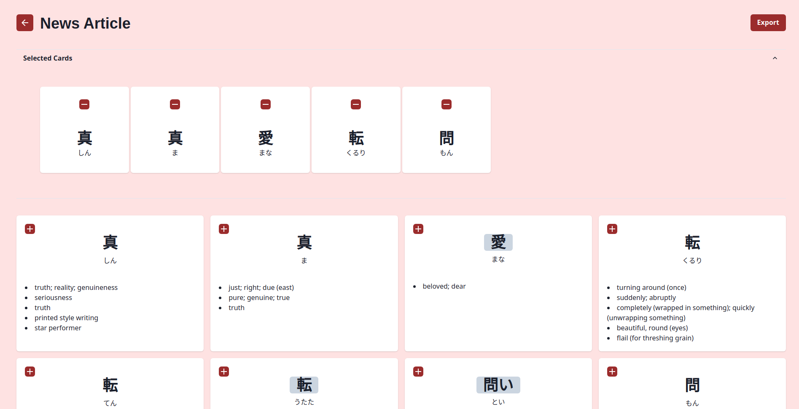

# Sunshelf

Sunshelf is a full-stack application built to make reading Japanese easier. Sunshelf helps streamline sentence mining by scanning documents for Japanese text and providing exportable flash cards for users.

## Screenshots

## Features
- Upload .epub, .pdf, .docx, and .txt files to be scanned through
- Automatically generate flashcards for extracted Japanese vocabulary including word readings and definitions
- Exportable flashcards based on user selection which can be imported into SRS software such as Anki

## Getting Started

This website can be accessed at https://sunshelf.vercel.app/ and can currently handle .epub, .pdf, .docx, and .txt files. 

This project can also be run locally. 

First, clone this repository. 

Navigate to the backend folder using `cd back/`. Create a Python virtual environment by running `python3 -m venv <name_of_virtual_env>`. Activate the virtual environment using `source <name_of_virtual_env>/bin/activate`. Install all backend dependencies using `pip install -r ./requirements.txt`. After installing dependencies, run the server using `flask run`. 

Then, navigate to the frontend folder using `cd front/`. Run `npm install` to install all dependencies. Then, run the development server using `npm run dev`. Open http://localhost:3000/ to see the result.