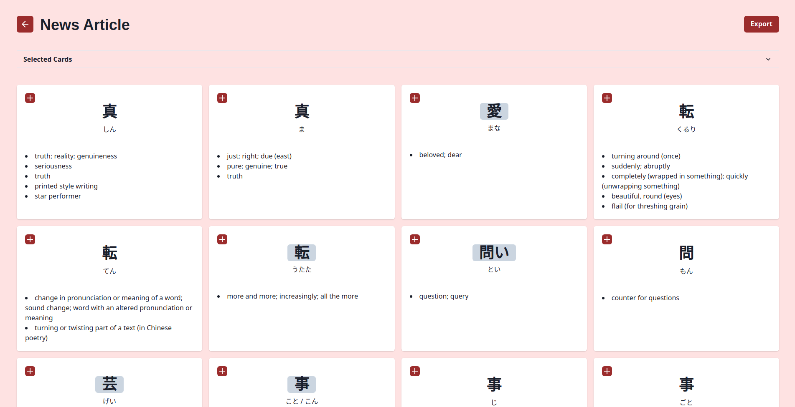

# Sunshelf

Sunshelf is a full-stack application built to make reading Japanese easier. Sunshelf helps streamline sentence mining by scanning documents for Japanese text and providing exportable flash cards for users.

## Features
- Upload .epub, .pdf, .docx, and .txt files to be scanned through
- Automatically generate flashcards for extracted Japanese vocabulary including word readings and definitions
- Exportable flashcards based on user selection which can be imported into SRS software such as Anki

## Usage

Home Page

Document Upload

Flashcard Export